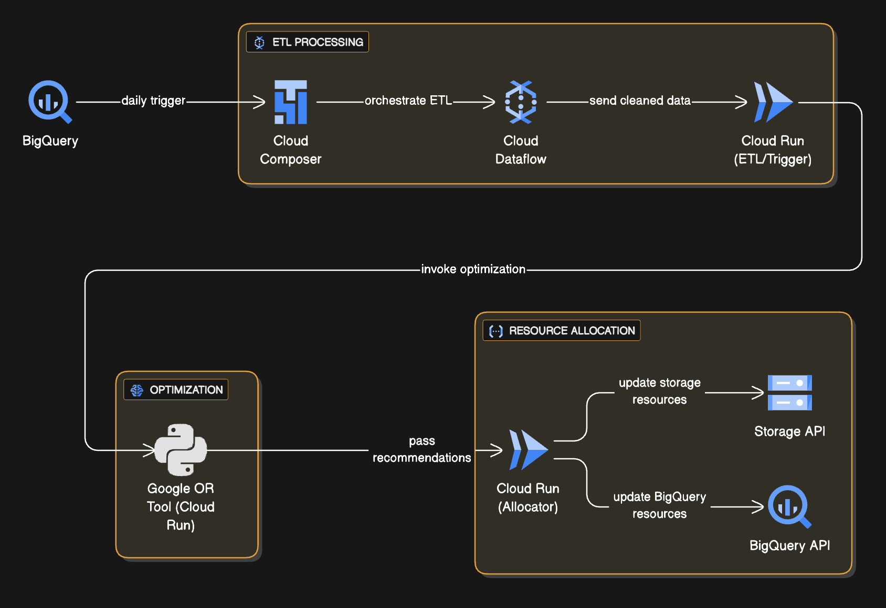

# GCP Cost Optimization

This project provides tools and scripts to help optimize costs in Google Cloud Platform (GCP) environments.

## Architecture Diagram



## Features

- Analyze GCP usage and spending
- Identify cost-saving opportunities
- Automate reporting

## Setup

1. **Clone the repository:**
   ```bash
   https://github.com/kiranfegade19/GCP_Cost_Optimization.git 
   cd GCP_Cost_Optimization
   ```

2. **Create and activate a virtual environment (recommended):**
   ```bash
   python3 -m venv venv
   source venv/bin/activate
   ```

3. **Install dependencies:**
   ```bash
   pip install -r requirements.txt
   ```

4. **Add your GCP service account key:**
   - Place your `abc.json` file in the project root directory.

## Configuration

Edit `config.py` to set your GCP project ID and region.

## Usage

Run your scripts as needed, for example:
```bash

```

## Security

- **Do not share your `abc.json` service account key.**
- The `.gitignore` file is configured to prevent accidental commits of sensitive files.

## License